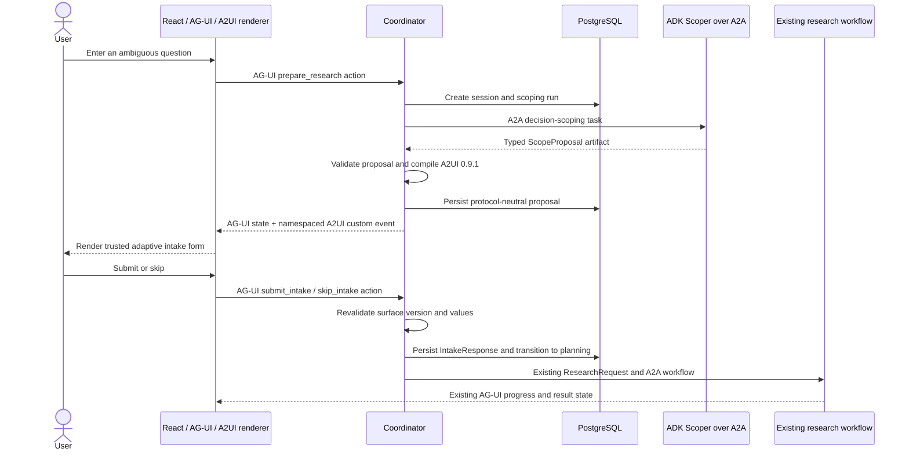

# Adaptive Decision Intake implementation plan

- Status: Stories 1 through 6 complete; Story 7 is next
- Decision: [ADR 0003](./adr/0003-bounded-a2ui-adk-intake.md)
- Last verified: 2026-08-27

## Outcome and value hypothesis

AgentDesk should use Google ADK, A2A, A2UI, and AG-UI together only where each one solves a real
problem. The selected feature is an optional adaptive intake step that turns an underspecified
comparison question into the existing typed `ResearchRequest` before research starts.

This is valuable for the current product, not merely a technology demonstration. The domain contract
already supports `options`, `constraints`, `criteria`, and `desired_depth`; the planner requires at
least two options. The live composer currently captures only `question`, while fixture mode injects
the other values. Adaptive intake closes that live-path gap and can ask domain-specific questions
instead of presenting one large generic form.

The hypothesis is:

> For ambiguous comparison questions, a short, domain-adaptive intake will capture more relevant
> options, constraints, and criteria, reduce wasted research, and improve the usefulness of the final
> recommendation enough to justify one extra user step and one bounded model call.

The implementation is worthwhile only if the evaluation gates below support that hypothesis.

## Responsibility map

| Technology | AgentDesk responsibility | Evidence that the use is substantive |
|---|---|---|
| Google ADK | Implement and evaluate the decision-scoping agent; run one bounded structured-output task with fixture and live providers | ADK agent, runner/session use, tool/trajectory tests, and ADK evaluation cases exist in an isolated service |
| A2A | Discover the scoper, create/stream/cancel its remote task, validate its typed artifact, and correlate task/context IDs | Existing A2A conformance suite is extended to the `decision-scoping` skill |
| A2UI | Describe and render a domain-adaptive intake surface from a trusted catalog | At least three decision domains produce materially different valid surfaces from the same catalog |
| AG-UI | Carry browser lifecycle, state, A2UI custom events, submit/skip actions, cancellation, errors, and rehydration | The browser still uses one AG-UI run/action channel and official event ordering |
| Coordinator | Validate, persist, compile, authorize, orchestrate, and recover | No model or UI SDK controls workflow transitions or database commits |

There is no separate "AUI" component in this plan. If that term is used informally, it should be
resolved to AG-UI or A2UI so architecture and resume claims stay precise.

## Target flow



### Direct path

The Coordinator may bypass intake when the submitted action already contains two to four unique
options and at least one criterion, or when the user explicitly skips. The bypass must be a
deterministic completeness check, not another unbounded model call. The public fixture demo retains
its current direct path unless a separate deterministic intake fixture is selected.

## Proposed contracts

All proposed types are application contracts, not SDK objects. Exact limits are part of the contract
and must be mirrored in Python and TypeScript fixtures.

### `ScopeProposal` artifact, schema 1.0

| Field | Rule |
|---|---|
| `proposal_id` | Stable non-empty identifier |
| `question` | Original normalized question; maximum existing AG-UI text size |
| `summary` | Short explanation of what must be clarified; plain text only |
| `fields` | One to eight unique `ScopeField` entries |
| `suggested_options` | Zero to four unique plain-text options |
| `suggested_criteria` | One to eight unique plain-text criteria |
| `suggested_constraints` | Zero to eight unique plain-text constraints |
| `default_depth` | `fast`, `normal`, or `deep` |

Each `ScopeField` has a stable ID, plain-text label/help text, `required`, a destination of `option`,
`criterion`, or `constraint`, and a kind from a closed enum: `short_text`, `single_select`,
`multi_select`, or `boolean`. Select fields have one to eight plain-text choices. No field contains
markup, URL, style, component name, executable expression, or nested layout.

The Coordinator rejects duplicate IDs, duplicate normalized values, incompatible field kind and
choice combinations, missing required option collection, excessive text/collection sizes, or any
unknown schema version. A valid proposal must make it possible to construct two to four options and
at least one criterion after defaults and user answers are combined.

### `IntakeResponse`, schema 1.0

The response identifies `session_id`, `proposal_id`, and `proposal_version`, then supplies bounded
answers keyed only by known field IDs. The Coordinator rejects stale proposals, unexpected fields,
wrong value types, values outside declared choices, missing required answers, and replay with a
different payload. Accepted values are normalized into:

```text
ResearchRequest(
    question=<original question>,
    options=<2..4 unique values>,
    constraints=<0..20 unique values>,
    criteria=<1..20 unique values>,
    desired_depth=<fast|normal|deep>,
)
```

The normalized `ResearchRequest` is persisted or reconstructable so later evaluation can prove which
intake values changed downstream work.

## Protocol and trust boundaries

### A2A and ADK

- Advertise one `decision-scoping` skill in an Agent Card and select it through the existing validated
  registry. A model cannot supply the service URL.
- Use A2A protocol 1.0 and `a2a-sdk[fastapi]` 1.1.2 on the wire. Preserve task/context IDs and
  cancellation just like existing specialists.
- Start with a compatibility spike against Google ADK 2.7.1's experimental A2A integration. It must
  pass AgentDesk card, send, stream, malformed-artifact, timeout, and cancellation tests.
- If the experimental bridge fails those tests, retain ADK for agent execution but expose it through
  AgentDesk's proven A2A service adapter. This is an adapter choice, not a protocol downgrade.
- The service returns only a `ScopeProposal` artifact. Reasoning, prompts, raw model events, and
  credentials never enter A2A artifacts, browser state, or logs.

### A2UI over AG-UI

- Pin A2UI protocol 0.9.1. Do not adopt the 1.0 candidate without a new compatibility decision.
- The Coordinator's deterministic compiler maps `ScopeProposal` to a full A2UI surface and validates
  it with `a2ui-core` 0.1.1.
- Emit the surface in an AG-UI custom event named `agentdesk.a2ui.surface.v1`. Include `sessionId`,
  `proposalId`, catalog version, protocol version, and a bounded message list.
- Do not create a second HTTP/SSE/WebSocket path for A2UI. AG-UI retains `RUN_STARTED`, state
  baseline, action, cancellation, error, and terminal ordering.
- Persist `ScopeProposal` and `IntakeResponse`, not A2UI wire messages. Rehydration recompiles from the
  accepted proposal and current catalog version.

### Browser catalog

The first catalog is intake-only and should expose the smallest accessible set needed: text, short
text input, single-choice group, multi-choice group, boolean choice, section/stack, primary submit,
and secondary skip. Component implementations, styles, event mapping, and accessibility labels stay
in the repository.

Unknown components, properties, bindings, actions, or protocol versions fail closed. Render errors
fall back to a trusted static form generated from the same proposal. There is no `dangerouslySetInnerHTML`,
remote image, arbitrary link, agent CSS, or markdown in the first release.

### AG-UI actions and state

Add versioned `prepare_research`, `submit_intake`, and `skip_intake` action envelopes rather than
overloading `start_research` with ambiguous behavior. Extend the durable/session projection with
`scoping` and `awaiting_input` states while keeping research, analysis, verification, and follow-up
transitions unchanged. A scoping AG-UI run may finish while the durable session waits for input; the
submission starts a new run in the same thread and session.

## Dependency and repository layout

The dependency conflict is architectural, not a lockfile nuisance:

- Root/Coordinator environment: keep OpenTelemetry 1.44.0 and A2A SDK 1.1.2; add only exact
  `a2ui-core==0.1.1` after a fresh resolution.
- Isolated scoper environment: exact `google-adk==2.7.1`, A2A SDK 1.1.2, and compatible service
  dependencies in its own `pyproject.toml` and lockfile. It must not install the root project as a
  dependency if that would import the root OpenTelemetry pins.
- Browser: exact `@a2ui/react==0.10.2` and `@a2ui/web_core==0.10.6`, with a reviewed lockfile and an
  audited DOMPurify resolution. Do not add `a2ui-agent-sdk` anywhere.

A practical layout is `services/scoper/` for the isolated ADK project and image, with shared
protocol-neutral contracts under `packages/contracts/`. Its container can copy only the shared
contract package and the scoper source instead of installing AgentDesk's root dependency set.

CI must resolve and test the root Python lock, scoper Python lock, and web npm lock independently.

## Security requirements

- Treat ADK output, A2A artifacts, A2UI messages, and browser answers as untrusted at every hop.
- Apply byte, collection, nesting, and text limits before persistence and rendering.
- Allow only the closed field/component/action catalogs. Reject unknown versions and extra fields.
- Bind submissions to owner, session, proposal ID/version, thread, and an idempotent action ID.
- Reject stale or replayed submissions whose normalized payload differs from the committed response.
- Use plain text initially. Enforce CSP and preserve React escaping. Audit all transitive rendering
  dependencies and add malicious strings to browser tests.
- Apply timeouts, one bounded model call, retry budgets, rate limits, and cancellation to the scoper.
- Log safe correlation IDs and validation codes, never questions, answers, prompts, model reasoning,
  tokens, headers, credentials, or raw artifacts.
- A scoper failure must offer the trusted static intake or skip path; it must not block research.

Required negative tests include unknown components/actions, unsafe properties and URLs, cyclic or
orphaned A2UI structures, oversized/deep payloads, XSS strings, malformed A2A DataParts, stale surface
submission, duplicate action replay, cross-session submission, timeout, cancellation, and rehydrate
after disconnect.

## Evaluation and go/no-go gates

Define the benchmark and scoring rubric before tuning the scoper. The initial suite should contain at
least 30 ambiguous comparison prompts across three domains and 10 already-complete control prompts.
Score option completeness, constraint capture, criterion relevance, downstream request validity, and
final recommendation usefulness. Preserve both unscoped and scoped outputs for comparison without
storing chain-of-thought.

The feature can become default-on only when all of these gates pass:

1. One hundred percent of benchmark proposals and compiled surfaces pass Python and TypeScript
   validation; malformed/fuzz cases fail closed.
2. At least three domains generate materially different forms using the same bounded catalog.
3. Accepted answers demonstrably change the persisted `ResearchRequest`, analyst criteria, and final
   output in integration tests.
4. The scoped flow improves the predefined ambiguous-prompt quality score by at least 15 percent
   relative to the direct baseline, with no material regression on complete controls.
5. The direct golden flow, AG-UI lifecycle, A2A conformance, cancellation, persistence, and recovery
   suites remain green.
6. Intake is keyboard accessible, has labelled controls and visible errors, and always provides
   skip/fallback behavior.
7. The configured test profile uses no more than one live scoping model call and meets the agreed
   latency and token budget recorded with the benchmark.
8. Dependency audit, container scan, and malicious-render browser suite have no unresolved high or
   critical finding.

If the quality gate fails, retain the static form/direct path and remove the production ADK/A2UI
feature flag. A working protocol demo without measurable product improvement is not enough to carry
the operational cost.

## Delivery stories and order

Complete and merge the hosted-demo story first. Then deliver each item as a small, independently
reviewable story; do not combine the dependency spike, persistence migration, renderer, and hosted
deployment into one change.

### Story 1: compatibility and conformance spike

Completed 2026-08-27. See the
[compatibility decision and evidence](./adaptive-intake-compatibility.md).

- Create the isolated scoper dependency project with exact pins.
- Prove ADK 2.7.1 plus A2A SDK 1.1.2 card/send/stream/cancel behavior.
- Prove root `a2ui-core` and web renderer lockfile resolution and audit status.
- Record actual resolved graphs and choose the ADK native A2A bridge or AgentDesk A2A adapter.
- No product route or hosted service is added yet.

### Story 2: scope contracts and evaluation fixtures

Completed 2026-08-27. See the
[benchmark, rubric, baseline, and go/no-go evidence](./adaptive-intake-benchmark.md).

- Add `ScopeProposal`, `ScopeField`, and `IntakeResponse` schemas and limits.
- Add cross-language golden/malformed fixtures and JSON Schema where useful.
- Add the versioned A2A artifact envelope and a deterministic three-domain fixture library.
- Commit the benchmark prompts, rubric, baseline results, and go/no-go calculation.

### Story 3: isolated ADK scoping agent

Completed 2026-08-27. See the
[isolated service implementation and evidence](./adaptive-intake-scoper.md).

- Implement structured ADK output, fixture and live provider modes, health/readiness, and Agent Card.
- Add timeout, retry, cancellation, safe telemetry, and ADK eval cases.
- Ensure fixture mode has no network/model credential dependency.

### Story 4: Coordinator intake lifecycle and persistence

Completed 2026-08-28. See the
[Coordinator lifecycle and persistence evidence](./adaptive-intake-lifecycle.md).

- Add prepare/submit/skip commands, idempotency, legal states, and A2A delegation.
- Add proposal/response persistence and Alembic migration with downgrade coverage.
- Reconstruct the normalized `ResearchRequest` and preserve persist-before-project semantics.
- Keep current `start_research` behavior as the direct/fallback path.

### Story 5: bounded A2UI compiler and transport

Completed 2026-08-28. See the
[bounded compiler, transport, and rehydration evidence](./adaptive-intake-a2ui.md).

- Add exact `a2ui-core` dependency and the proposal-to-A2UI 0.9.1 compiler.
- Validate size, structure, catalog, binding, and reachability before emission.
- Add the namespaced AG-UI custom event and rehydration recompilation.
- Test invalid proposals, compiler determinism, and no event after terminal.

### Story 6: trusted React intake renderer

Completed 2026-08-28. See the
[trusted React renderer and browser-boundary evidence](./adaptive-intake-renderer.md).

- Add exact A2UI renderer packages, audited overrides, and lockfile.
- Implement the small accessible custom catalog and local static fallback.
- Map A2UI events to strict submit/skip AG-UI actions and reject stale surfaces.
- Add component, contract, accessibility, security, and browser tests.

### Story 7: end-to-end fixture demo and evaluation

- Run the full browser -> AG-UI -> Coordinator -> A2A scoper -> A2UI -> AG-UI submission -> existing
  specialists path with deterministic fixtures.
- Cover submit, skip, failure fallback, cancellation, replay, disconnect, and history rehydration.
- Execute the benchmark and publish results. Do not enable live-by-default unless every gate passes.

### Story 8: feature-gated hosted rollout

- Add scoper health/dependency wiring to Compose first.
- Add the private hosted service only after local/CI gates pass and its recurring cost is explicitly
  approved. The topology becomes six services plus PostgreSQL.
- Configure secrets only for live scoping mode; public fixture mode stays key-free.
- Add dashboards for proposal validity, intake completion/skip, fallback, latency, token use, and
  downstream quality without logging user content.
- Roll out disabled, then opt-in, then default-on only after production evidence supports it.

## Operational and rollback plan

The safest initial deployment is local and CI only. Adding the scoper to hosted Render requires a
separate private compute service because its dependency environment cannot safely share the existing
Coordinator image. That is a real recurring cost and one more failure domain, so it must not be
silently folded into the current hosted-demo blueprint.

Feature flags must independently control scoper delegation, A2UI rendering, and live model use. A
rollback disables adaptive intake and routes new questions through the current direct/static flow;
existing accepted responses remain readable protocol-neutral records. Removing the scoper does not
require rewriting research, analysis, verification, or result rendering.

## Defensible project and resume claims

After implementation and evaluation, a precise description is:

> Built a feature-gated adaptive decision-intake flow using Google ADK for evaluated structured
> scoping, A2A 1.0 for isolated agent delegation, A2UI 0.9.1 for validated declarative forms, and
> AG-UI for browser lifecycle and actions; preserved a deterministic Coordinator, persisted typed
> artifacts, and measured downstream decision-quality impact against a fixture benchmark.

Do not claim that AgentDesk was "rewritten in ADK," that A2UI is the transport, or that package
installation alone demonstrates production experience. The defensible value comes from protocol
boundaries, dependency isolation, security validation, conformance tests, and measured product
impact.

## Source baseline

- [Google ADK package and Python support](https://pypi.org/project/google-adk/)
- [Google ADK evaluations](https://adk.dev/evaluate/)
- [Google ADK A2A integration and experimental status](https://adk.dev/a2a/)
- [Google ADK A2UI integration](https://adk.dev/integrations/a2ui/)
- [A2UI renderer version guidance](https://github.com/a2ui-project/a2ui/blob/main/docs/public/guides/renderer-development.md)
- [A2UI protocol candidate and transport bindings](https://github.com/a2ui-project/a2ui/blob/main/specification/v1_0/docs/a2ui_protocol.md)
- [A2UI core validation package](https://pypi.org/project/a2ui-core/)
- [A2UI agent SDK dependency baseline](https://pypi.org/project/a2ui-agent-sdk/)
- [AG-UI ADK middleware](https://github.com/ag-ui-protocol/ag-ui/blob/main/integrations/adk-middleware/python/README.md)
