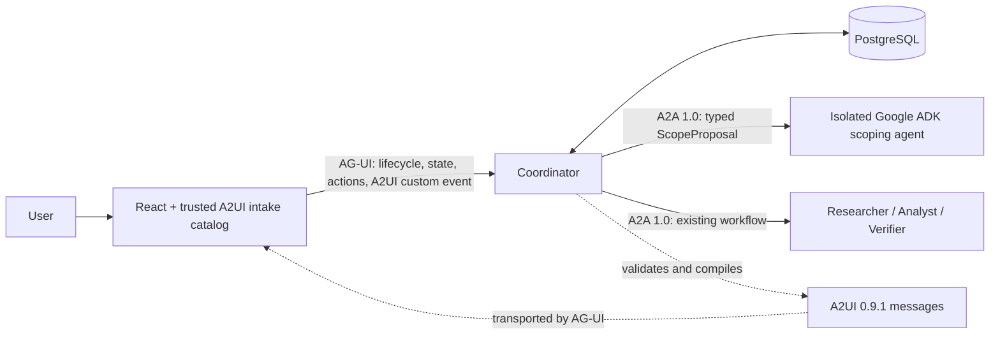

# ADR 0003: Add bounded A2UI intake and an isolated Google ADK scoping agent

- Status: Accepted for phased, feature-gated implementation
- Date: 2026-08-27
- Depends on: [ADR 0002](./0002-ag-ui-frontend-protocol.md)
- Scope: adaptive decision intake only

## Context

AgentDesk currently has a useful mismatch between its domain model and its live browser flow.
`ResearchRequest` accepts options, constraints, criteria, and desired depth, and the Coordinator
planner rejects requests with fewer than two named options. The live React composer, however,
collects only a question; only deterministic demo mode supplies the remaining fields. A fixed form
could close this gap, but different decisions need materially different clarification. A database
choice, a deployment decision, and a vendor selection do not have the same useful constraints or
criteria.

AG-UI, A2UI, A2A, and Google ADK are not substitutes:

- AG-UI owns browser-to-Coordinator run lifecycle, messages, state, actions, cancellation, and
  recovery.
- A2UI describes a declarative surface that a trusted renderer can display.
- A2A owns Coordinator-to-agent discovery, task lifecycle, artifacts, correlation, and
  cancellation.
- Google ADK is an agent implementation framework. It does not replace any of those wire
  protocols or AgentDesk's durable control plane.

ADR 0002 removed A2UI because the implemented result workspace did not need agent-selected render
trees. That reasoning still applies to results, progress, history, and follow-up actions. A bounded
adaptive intake form is a narrower use case where declarative generated UI can add product value:
it can turn an underspecified question into a validated `ResearchRequest` before expensive research
begins.

## Verified feasibility baseline

The following compatibility checks were performed against the repository on 2026-08-27. Package
versions and protocol versions are independent and remain exactly pinned.

| Component | Evaluated baseline | Result |
|---|---|---|
| AgentDesk Python | Python 3.14; A2A SDK 1.1.2; OpenTelemetry 1.44.0 | Existing baseline |
| Google ADK | `google-adk` 2.7.1 | Supports Python 3.14, but conflicts with the root OpenTelemetry 1.44.0 pins because ADK requires OpenTelemetry no newer than 1.42.1 |
| ADK plus current A2A | `google-adk` 2.7.1 and `a2a-sdk[fastapi]` 1.1.2 | Resolves in an isolated environment |
| A2UI Python agent SDK | `a2ui-agent-sdk` 0.5.0 | Rejected: requires A2A SDK 0.3.x and is incompatible with AgentDesk's A2A 1.0 baseline |
| A2UI core validation | `a2ui-core` 0.1.1 | Resolves in the existing Coordinator environment without changing A2A or OpenTelemetry |
| A2UI React renderer | `@a2ui/react` 0.10.2 and `@a2ui/web_core` 0.10.6 | Compatible with the existing React 19.2.8, React DOM 19.2.8, Zod 3.25.76, and Node baseline |
| A2UI protocol | 0.9.1 | Current production protocol; 1.0 remains a candidate and is not selected |

The A2UI renderer dependency graph must be audited when installed. The evaluated graph included
`@a2ui/markdown-it`, which pinned an older DOMPurify release. The implementation must either remove
that renderer path or add an audited package override and prove the resulting lockfile with
`npm audit` and browser security tests.

## Decision

AgentDesk will implement **Adaptive Decision Intake** as a bounded optional capability after the
current hosted-demo story is complete.

1. Keep the existing Coordinator as the deterministic control plane and persistence owner.
2. Add one independently deployable decision-scoping agent implemented with Google ADK. It has its
   own Python project, exact lockfile, Docker image, and OpenTelemetry versions.
3. Call the scoping agent over AgentDesk's current A2A 1.0 boundary. Its only accepted artifact is a
   protocol-neutral, strictly validated `ScopeProposal`.
4. Do not install `google-adk` or `a2ui-agent-sdk` in the root AgentDesk environment. Do not allow an
   old A2A 0.3 dependency to enter any service.
5. Compile an accepted `ScopeProposal` to A2UI 0.9.1 messages inside the Coordinator. Validate the
   result with `a2ui-core` before emission.
6. Carry A2UI messages inside namespaced AG-UI custom events. AG-UI remains the sole browser
   transport and action/lifecycle protocol.
7. Render the surface with the maintained A2UI React renderer and a repository-owned intake catalog.
   The scoping agent may choose only bounded field kinds and content; it cannot provide HTML,
   JavaScript, URLs, styles, functions, arbitrary component names, or raw A2UI messages.
8. Convert A2UI user events to versioned `submit_intake` or `skip_intake` AgentDesk actions. The
   Coordinator revalidates every value and compiles it to the existing `ResearchRequest` contract.
9. Persist the protocol-neutral proposal and response, not renderer state or raw A2UI messages.
   Rehydration deterministically recompiles a fresh surface.
10. Retain the current direct start path as a skip/fallback path and preserve deterministic fixture
    mode. No Google API key is required for the public demo.

The detailed contracts, stories, security controls, evaluation gates, and rollout order are in the
[Adaptive Decision Intake implementation plan](../adaptive-intake-plan.md).

## Why the Coordinator is not replaced by Google ADK

The Coordinator already provides explicit workflow transitions, idempotent actions, transaction
boundaries, persisted artifacts, partial-result behavior, cancellation propagation, recovery, and
strict AG-UI projection. Reimplementing those controls in ADK would be a high-risk rewrite with no
corresponding user benefit. ADK adds value where model-driven behavior is wanted: producing a typed,
evaluated scope proposal. A service boundary also contains ADK 2.x API churn and its dependency
constraints.

## Why raw agent-generated A2UI is rejected

Allowing the ADK agent to emit arbitrary A2UI directly to the browser would combine two changing
interfaces, widen the trust boundary, make persisted recovery renderer-dependent, and invite prompt
injection to influence presentation. It would also encourage use of `a2ui-agent-sdk` 0.5.0, whose
A2A 0.3 dependency conflicts with the project's A2A 1.0 commitment. A typed proposal followed by a
deterministic compiler demonstrates real A2UI use without granting presentation authority to a
model.

## Product and delivery gates

The feature remains off by default until all gates in the implementation plan pass. In particular,
it must improve a predefined ambiguous-question benchmark, preserve the existing golden flow,
produce only valid bounded surfaces, remain skippable, and demonstrate that accepted intake values
change the downstream research request and result. If it does not improve decision quality, the ADK
service and A2UI surface will remain a documented spike rather than production complexity.

## Consequences

Positive consequences:

- The live product gains a missing path for collecting the options and criteria its Coordinator
  already requires.
- Each technology has one clear, independently testable responsibility that can be explained without
  claiming that protocols are frameworks or that frameworks are protocols.
- Existing deterministic orchestration, persistence, AG-UI behavior, and specialist services remain
  intact.
- Dependency churn is contained behind an A2A contract and an isolated lockfile.
- A bounded catalog and server-side compilation keep model output away from executable presentation.

Tradeoffs:

- One more agent service adds build, observability, health-check, deployment, and potentially paid
  compute cost. A hosted rollout would increase the current topology from five services to six,
  plus PostgreSQL.
- Intake introduces one extra interaction before research and must be skipped for already complete
  requests.
- A2UI and ADK are fast-moving; ADK's documented A2A integration is experimental. Exact pins,
  adapter isolation, conformance tests, and feature flags are mandatory.
- A2UI surface validation is required in both Python and TypeScript, and accessibility/security tests
  become part of the browser quality gate.

## References

- [Google ADK package](https://pypi.org/project/google-adk/)
- [Google ADK evaluation documentation](https://adk.dev/evaluate/)
- [Google ADK A2A documentation](https://adk.dev/a2a/)
- [Google ADK A2UI integration](https://adk.dev/integrations/a2ui/)
- [A2UI v1.0 candidate protocol](https://github.com/a2ui-project/a2ui/blob/main/specification/v1_0/docs/a2ui_protocol.md)
- [A2UI renderer development guide](https://github.com/a2ui-project/a2ui/blob/main/docs/public/guides/renderer-development.md)
- [A2UI core package](https://pypi.org/project/a2ui-core/)
- [A2UI agent SDK package](https://pypi.org/project/a2ui-agent-sdk/)
- [AG-UI Google ADK middleware](https://github.com/ag-ui-protocol/ag-ui/blob/main/integrations/adk-middleware/python/README.md)
