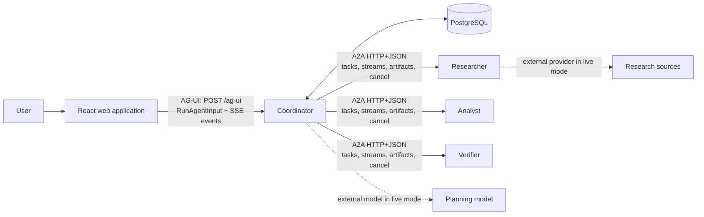
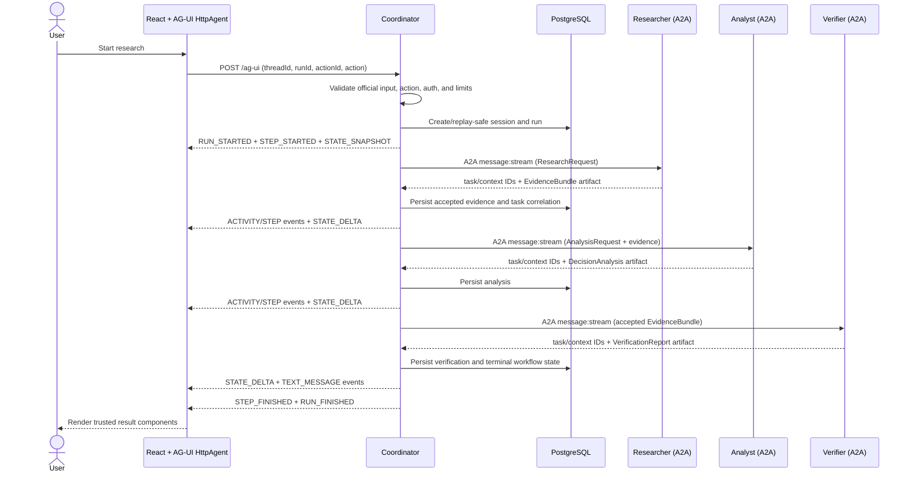

# AgentDesk architecture

AgentDesk separates browser interaction, workflow orchestration, specialist execution, and durable domain state. The browser talks only to the Coordinator. The Coordinator discovers and delegates to independently deployable specialists; specialists never choose frontend components or write directly to browser state.

The protocol baseline is recorded in [ADR 0001](./adr/0001-protocol-versions.md) and corrected for the implemented frontend in [ADR 0002](./adr/0002-ag-ui-frontend-protocol.md).

## System overview

| Boundary | Responsibility | Must not own |
|---|---|---|
| React web app | User input, trusted presentation, AG-UI client lifecycle, validated local view state | Workflow decisions, A2A calls, arbitrary agent-selected UI |
| Coordinator | AG-UI admission, bounded A2UI compilation, planning, orchestration, persistence, state projection, recovery | Specialist implementation details, browser rendering |
| Researcher | Gather and synthesize evidence into an `EvidenceBundle` | Recommendation or UI state |
| Analyst | Compare options and challenge recommendations using accepted evidence | Research transport or verification verdicts |
| Verifier | Check claims against the accepted evidence bundle | Workflow ordering or presentation |
| PostgreSQL | Sessions, runs, task correlations, typed artifacts, and terminal workflow state | Transient stream ownership or model reasoning |

## Why AG-UI and A2A are both used

AG-UI and A2A solve different layers of the request.

- **AG-UI** is user-to-agent interaction. `RunAgentInput` carries a stable thread, a unique run, the transcript, the last observed state, and a strict AgentDesk action envelope. The Coordinator returns ordered run, step, activity, message, state, error, and terminal events over SSE.
- **A2A** is agent-to-agent collaboration. Agent Cards advertise capabilities and readiness. The Coordinator creates remote tasks, consumes typed task streams and artifacts, retains remote task/context IDs, and propagates cancellation.
- **A2UI** is used only for the adaptive-intake surface approved by ADR 0003. The scoper returns a protocol-neutral `ScopeProposal`; the Coordinator—not the agent—maps it to a full A2UI 0.9.1 surface from a seven-component allowlist, validates protocol structure and graph integrity with `a2ui-core`, and embeds it in `agentdesk.a2ui.surface.v1`. AG-UI remains the lifecycle, action, cancellation, and transport boundary. Persisted proposals are recompiled during rehydration, so renderer messages never become domain state.

The split lets specialists remain independently deployable and UI-neutral, while the browser receives a protocol designed for interactive run state. Shared Pydantic domain contracts sit between these adapters and are the persistence source of truth.

## Complete request sequence

The persist-before-project rule matters: a state delta represents committed domain state, so a broken browser stream cannot become the only holder of a completed artifact. Reconnection uses the same thread and a new run to request a fresh authoritative snapshot rather than attempting byte-level SSE replay.

## Workflow and partial results

The comparison workflow has a deterministic dependency order:

1. Research produces and durably commits an `EvidenceBundle`.
2. Analysis consumes that accepted bundle and commits a `DecisionAnalysis`.
3. Verification evaluates the same evidence and commits a `VerificationReport`.

Verification runs last so a verifier outage or rejected artifact does not discard successful research or analysis. The Coordinator can finish a run as partial, preserve earlier artifacts, expose a targeted retry, and rehydrate the same session later.

Follow-up actions such as challenge, deeper research, criterion focus, and specialist retry create a new AG-UI `runId` inside the existing `threadId` and durable session. The machine-readable action and displayed user message are validated together.

## Identifier and trace correlation

| Identifier | Scope | Purpose |
|---|---|---|
| `threadId` | Browser conversation | Stable across initial and follow-up AG-UI runs |
| `runId` | One AG-UI execution attempt | Correlates one stream and becomes the initial session ID for new research |
| `actionId` | One submitted action | Idempotency key; duplicate actions cannot create duplicate work |
| `sessionId` | Durable research session | Joins persisted workflow state, artifacts, history, and follow-ups |
| A2A `contextId` | Specialist conversation context | Retains remote protocol context for delegation and diagnostics |
| A2A task ID | One specialist task | Targets artifact persistence, status, retry, and cancellation |
| `traceId` / `spanId` | Distributed trace | Joins Coordinator and outbound specialist spans without logging payloads |

Structured logs carry the safe subset of session, browser thread/context, run/correlation, action, agent, remote task, trace, and span identifiers. Requests, prompts, tokens, raw artifacts, headers, and model reasoning are deliberately excluded.

## State, persistence, and rendering

`AgentDeskViewState` schema `1.0` is canonical in Python and mirrored with runtime validation in TypeScript. It contains renderable facts: workflow status, specialist state, evidence, claims, analysis, verification, warnings, errors, available actions, and timestamps. Unknown versions, invalid patches, unsafe URLs, and unbounded inputs fail closed.

The frontend store consumes only validated snapshots and RFC 6902 deltas. Selectors choose trusted React components; protocol events cannot select executable code. Persistence stores domain state and the correlations needed for idempotency and recovery, not an unbounded transcript of every transient event.

## Security and reliability boundaries

- Browser and service authentication modes are configured independently; local mode is explicit.
- The AG-UI middleware bounds identifiers, messages, state, patches, and forwarded properties.
- A2A providers are selected from validated Agent Cards in the capability registry, not from model-supplied URLs.
- Per-operation timeouts, retry limits, request budgets, and cancellation propagation bound remote work.
- `RUN_STARTED` is first, one terminal `RUN_FINISHED` or `RUN_ERROR` is last, and no event may follow it.
- Semantic phases are reported as observed states; the UI does not fabricate progress percentages.
- Raw prompts, secrets, stack traces, and chain-of-thought never enter browser state or structured logs.

## Runtime modes and deployment shape

The base [Compose stack](../compose.yaml) runs production entry points and labels the browser **Live mode**. The explicit [demo override](../compose.demo.yaml) swaps only the planner and specialists for golden fixture entry points, applies fixed stage delays, clears live model configuration, and labels the browser **Fixture demo**. Both modes keep the same AG-UI, A2A, persistence, migration, health, and rendering boundaries.

For local use, Compose exposes services only on loopback. The default [hosted demo](./deployment.md) runs the same containers on demand in GitHub Codespaces, removes Coordinator and specialist host ports, and forwards only the production web server through GitHub's TLS ingress. The public service proxies only AG-UI and history paths to the private Compose-network Coordinator. A paid Render Blueprint is retained as optional production-shaped infrastructure-as-code, not as a provisioned requirement.

See the [deterministic demo walkthrough](./demo.md) for the executable path and expected results.
